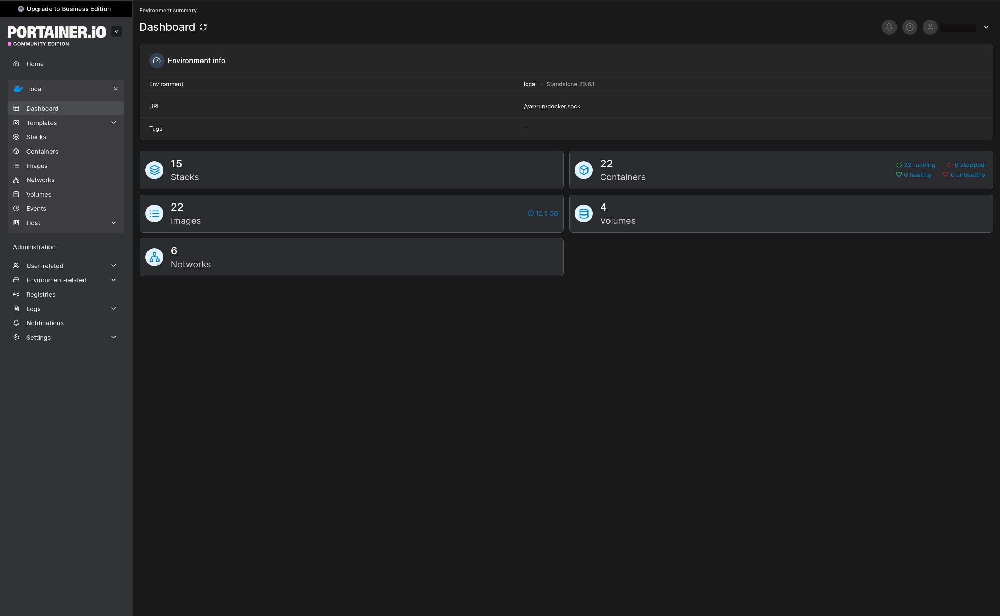

# Portainer with Traefik Reverse Proxy

**Tech Stack:** Docker • Docker Compose • Portainer CE • Traefik • Let's Encrypt • Linux • YAML

## Overview

This project documents the deployment of Portainer Community Edition behind a Traefik reverse proxy within a Docker-based homelab environment.

Portainer provides a web-based interface for managing Docker containers, images, networks, volumes and application stacks. Traefik securely publishes the Portainer interface using host-based routing, HTTPS termination and automatically managed TLS certificates.

The deployment uses a shared external Docker network, allowing Traefik to route requests to Portainer without exposing the Portainer management port directly on the host.

---

## Project Objectives

The objectives of this project were to:

- Deploy Portainer Community Edition using Docker Compose
- Provide persistent storage for Portainer configuration and data
- Integrate Portainer with Traefik using Docker labels
- Secure external access using HTTPS
- Automatically obtain and renew TLS certificates
- Avoid directly exposing Portainer management ports
- Gain practical experience managing Docker infrastructure through a centralised interface

---

## Architecture



External HTTPS requests are received by Traefik and matched against the configured Portainer hostname.

Traefik terminates TLS, applies the configured routing rules and forwards traffic to the Portainer container through the shared Docker proxy network.

Portainer communicates with the local Docker Engine through the mounted Docker socket and stores its persistent application data in a Docker volume or host-mounted directory.

---

## Technologies Used

- Docker
- Docker Compose
- Portainer Community Edition
- Traefik
- Let's Encrypt
- Docker Networks
- Linux
- YAML

---

## Repository Structure

```text
portainer/
├── README.md
├── docker-compose.yml
├── .env.example
├── .gitignore
└── images/
    └── architecture.png
```

The repository contains the Docker Compose deployment configuration, environment variable template and supporting architecture documentation.

---

## Design Decisions

### Traefik reverse proxy

Traefik was used to expose Portainer because it supports Docker service discovery and label-based routing.

This allows Portainer routing to be defined directly within the Compose file without maintaining a separate reverse proxy configuration.

### Shared external network

Portainer is connected to the same external Docker network as Traefik.

This allows Traefik to communicate directly with the Portainer container while avoiding the need to publish Portainer's internal management port on the host.

### Persistent storage

Portainer data is stored in a persistent Docker volume or host-mounted directory so that users, settings, endpoints and stack definitions survive container recreation or upgrades.

### Docker socket access

The Docker socket is mounted into the Portainer container to allow it to manage the local Docker Engine.

This provides full management capability but also represents a privileged level of access and should therefore be restricted to trusted administrators.

---

## Prerequisites

Before deploying the project, ensure that the following requirements are available:

- Docker installed
- Docker Compose installed
- Traefik running
- An external Docker proxy network
- A DNS record pointing the Portainer hostname to the server
- A configured Traefik certificate resolver
- A valid domain name

Create the external proxy network if it does not already exist:

```bash
docker network create proxy
```

---

## Environment Configuration

Copy the example environment file:

```bash
cp .env.example .env
```

Update the values in `.env`:

```env
PORTAINER_HOST=portainer.example.com
```

Replace `portainer.example.com` with the hostname used for your deployment.

The real `.env` file should not be committed to source control.

---

## Deployment

Clone the repository:

```bash
git clone https://github.com/sanju-mathew/portainer.git
cd portainer
```

Validate the Docker Compose configuration:

```bash
docker compose config
```

Deploy Portainer:

```bash
docker compose up -d
```

Check the container status:

```bash
docker compose ps
```

View the logs:

```bash
docker compose logs -f portainer
```

After deployment, open the configured Portainer hostname in a web browser:

```text
https://portainer.example.com
```

On the first visit, Portainer will prompt you to create the initial administrator account.

---

## Validation

After deployment, I verified that:

- The Portainer container started successfully
- Portainer connected to the shared Traefik network
- Traefik detected the Portainer router and service
- The configured domain resolved correctly
- HTTP requests redirected to HTTPS
- A valid TLS certificate was issued
- The Portainer interface was accessible through the custom domain
- Portainer could manage the local Docker environment
- Portainer data remained available after container recreation

Useful validation commands include:

```bash
docker compose ps
```

```bash
docker network inspect proxy
```

```bash
docker compose logs portainer
```

```bash
docker logs traefik
```

---

## Security Considerations

The deployment incorporates the following security practices:

- HTTPS encryption using Traefik and Let's Encrypt
- Portainer is not directly exposed through a host port
- Docker routing is restricted using `exposedByDefault: false`
- Portainer data is stored persistently
- The container uses a restart policy for service availability
- Access is restricted to the configured hostname
- Environment files are excluded from source control

The Docker socket provides extensive control over the host Docker environment. Anyone with administrative access to Portainer may effectively gain privileged control over the Docker host.

For this reason:

- Portainer should use a strong administrator password
- Access should be restricted to trusted users
- The interface should not be publicly exposed without additional protection
- Multi-factor authentication should be enabled where available
- Access can be further restricted through VPN, identity-aware proxy or IP allow-listing

---

## Engineering Outcomes

This project strengthened my practical understanding of:

- Docker container management
- Docker socket integration
- Reverse proxy routing
- Docker label-based configuration
- Persistent storage
- Docker networking
- TLS certificate management
- Secure publishing of administrative services
- Container deployment validation
- Infrastructure documentation

The project also demonstrated how administrative services can be centrally managed while remaining securely accessible through a reverse proxy.

---

## Potential Enhancements

Possible future improvements include:

- Protect Portainer using Traefik forward authentication
- Restrict access using an IP allow list
- Integrate CrowdSec middleware
- Add single sign-on authentication
- Enable automated container image updates
- Add monitoring and alerting for Portainer availability
- Back up the Portainer persistent data
- Pin the Portainer image to a specific version
- Replace direct Docker socket access with a socket proxy
- Restrict access through a VPN such as Tailscale

---

## Skills Demonstrated

- Docker
- Docker Compose
- Portainer
- Traefik
- Reverse Proxy Configuration
- Docker Networking
- Persistent Storage
- TLS and HTTPS
- Linux Administration
- YAML
- Infrastructure Security
- Technical Documentation